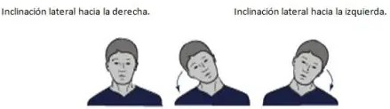

# TFG-GlassMusic 
>Este repositorio contiene todas las pruebas, implementaciones y avances desarrollados durante mi Trabajo de Fin de Grado. 

 Tabla de contenidos 

1. [Sobre el proyecto](#ℹ️sobre-el-proyecto)
2. [Objetivos](#objetivos)

    2.1 [Principal](#principal)

    2.2 [Extra](#extra)
3. 

## ℹ️Sobre el proyecto 
El objetivo principal del proyecto fue investigar, diseñar y desarrollar las funcionalidades principales dentro de la aplicación en desarrollo de GlassMusic. 

Dichas funcionalidades se implentarón dentro de Unity, en lenguaje C#.

También se realizaron diferentes comprovaciones para el correcto funcionamiento del objetivo principal. 

## 🚩Objetivos
### Principal
El objetivo principal es el avace o retroceso de pàginas mediante la inclinación lateral del cuello. 
### Extra➕ 
Se implementó la funcionalidad de detección de sonido. 
## Tecnologías utilizadas 
Las herramientas utilizadas en el transcurso del proyecto fueron las siguientes: 
-  

- 
- [C#](https://img.shields.io/badge/C%23-239120?style=flat&logo=unity&logoColor=white)

- 

 Unity 

És una multiplataforma de desarrollo orientada al desarrollo de videojuevos y aplicaciones interactivas. 
### Elementos claves:
Los elementos principales que tiene Unity a la hora de la implementación, són los siguientes:  
1. **Escenas:** Son los espacios donde se desarrolla el juego, como niveles o menús. Cada escena contienen los objetos que se usan en esa parte del juego.
2. **GameObjects**: Son los objetos que forman parte de la escena, como luces, cámaras o decoraciones. Son la base.
3. **Componentes**: Son las partes que se agregan a los GameObjects para darles funciones, como movimiento, sonido, físicas o scripts. Sin estos componentes los GameObjects no pueden hacer nada. 

## 🧪Pruebas Funcionales
### 1. Cambio de página/párrafo por inclinación lateral
**Objetivo:** Permitir al usuario avanzar o retroceder páginas o párrafos de una partitura sin necesidad de presionar botones ni movimientos excesivos con la cabeza, utilizando gestos sutiles basados en inclinación.

En la anterior imagen se puede obserbar una representación de inclinación lateral.
#### Pasos realizados y evolución 
Para alcanzar el objetivo propuesto, se plantearon distintas formas de implementación. Una de ellas consiste en aprovechar el eje de Z, mientras que otra se basa en el uso del acelerómetro del dispositivo móvil. 
##### Navegación por inclinación  
Al empezar a desarrollar el código se tuvo en cuenta la inclinación del eje **Z** de los cuaterniones. Con esta implementación, he logrado completar este objetivo. 

**Pasos:**
- Al inclinar la cabeza o el móvil hacia la derecha: se avanza 
- Al inclinar hacia la derecha: se retrocede 
- Se requiere mantener la inclinación 3 segundo para evitar gestos accidentales. 

Esto se implementa mediante la rotación en el Z. Si el valor supera un umbral (por ejemplo +/- 20 grados), se cuenta el tiempo mantenido y se ejecuta la acción.

##### Navegación con el Acelerómetro

**Posibles errores** 
Cuando una persona, inclina la cabeza entre 5º y 10º, es casi imperceptible, por lo cual podría generar inclinaciones involuntarias. 

|        Grados     |     Tipo de control   |  Tipo de inclinación |
|-------------------|-----------------------|----------------------|
|       5º-10º      |   Seminvoluntario     |  Leve                |
|       10º-20º     |   Volunatario         |  Moderada/Normal     |
|       20º-35º     |   Involuntario        |   Pronunciada        |
|       >=35º       |   Involuntario        |   Muy Pronunciada    |

##### Demostración 

Al determinar cuántos grados sería aceptable para evitar acciones involuntarias, se realizó pruebas en Unity donde podemos ejecutar con simuladores en el inspector. 

En la primera parte se observa que cuando cambiamos el eje de las Z su rotación y este supera los 20º o es inferior a -20º, procede a avanzar o retrocer los párrafos en caso de estar en ese modo y las páginas en caso de estar en modo completo. 
La segunda parte del video, se puede observar como se capta los angulos y encima muestra el párrafo dónde se encuentra.

### 2. Sonido 
### 3. Corrección de errores 

## Contacto 
- Para cualquier duda podeis contactar con AprilSkarleth.Chavez@autonoma.cat
- Web Oficial de Glassear: https://glassear.com/  
